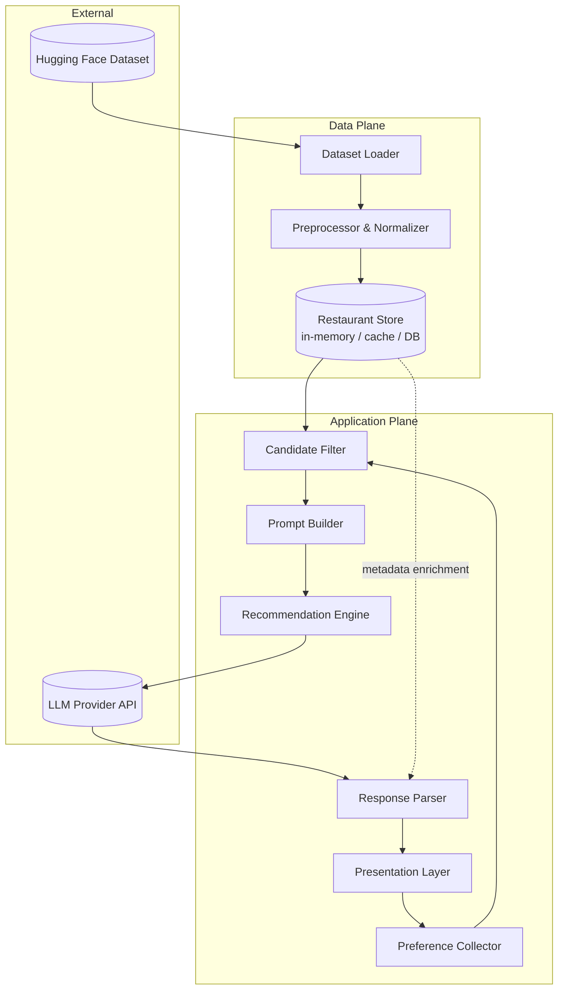
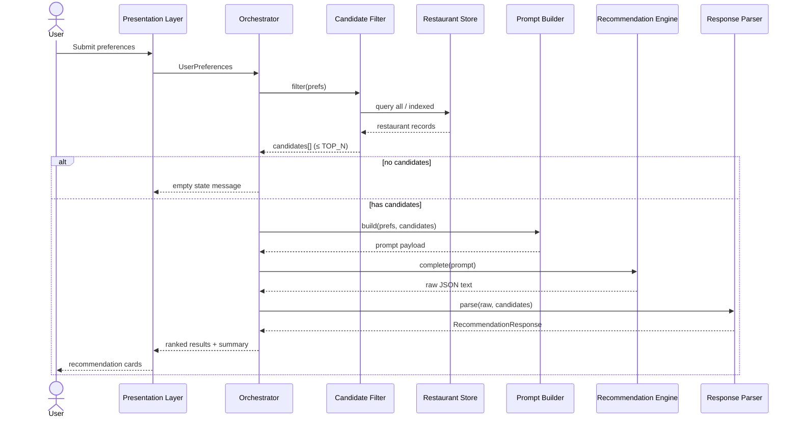
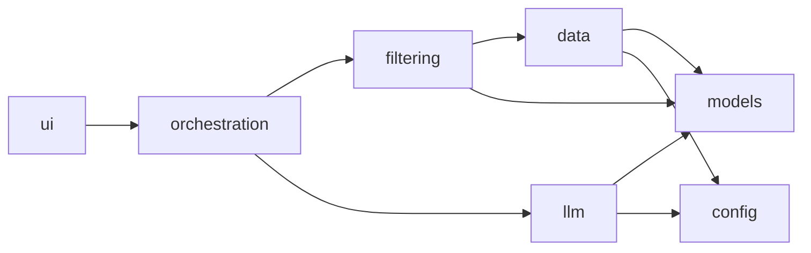
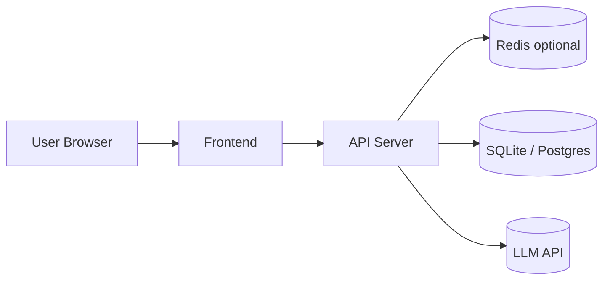

# Architecture: AI-Powered Restaurant Recommendation System

This document defines the technical architecture for the Zomato-inspired restaurant recommendation service described in [`context.md`](context.md). It translates product requirements into components, data flows, interfaces, and implementation guidance.

---

## Table of Contents

1. [Architecture Principles](#architecture-principles)
2. [High-Level System Architecture](#high-level-system-architecture)
3. [Component Architecture](#component-architecture)
4. [Data Architecture](#data-architecture)
5. [Request Lifecycle](#request-lifecycle)
6. [Integration Layer](#integration-layer)
7. [Recommendation Engine (LLM)](#recommendation-engine-llm)
8. [Presentation Layer](#presentation-layer)
9. [Recommended Project Structure](#recommended-project-structure)
10. [Technology Stack](#technology-stack)
11. [Interfaces & Contracts](#interfaces--contracts)
12. [Cross-Cutting Concerns](#cross-cutting-concerns)
13. [Deployment Architecture](#deployment-architecture)
14. [Testing Strategy](#testing-strategy)
15. [Future Extensions](#future-extensions)

---

## Architecture Principles

| Principle | Description |
|-----------|-------------|
| **Dataset as source of truth** | Restaurant facts (name, location, cuisine, cost, rating) come only from the Hugging Face Zomato dataset—not from LLM hallucination. |
| **Structured-first, LLM-second** | Hard filters (location, budget band, cuisine, min rating) run on structured data before the LLM sees candidates. |
| **LLM for judgment, not retrieval** | The LLM ranks, explains, and optionally summarizes a bounded candidate set—not the entire catalog. |
| **Separation of concerns** | Ingestion, filtering, prompting, inference, and UI are distinct modules with clear boundaries. |
| **Inspectable outputs** | Every recommendation ties back to a dataset row; explanations augment, not replace, structured fields. |
| **Fail gracefully** | Empty filter results, LLM timeouts, and malformed responses degrade to clear user messaging—not silent errors. |

---

## High-Level System Architecture

The system follows a **pipeline architecture**: ingest once (or on schedule), serve requests through filter → prompt → LLM → render.



### Logical Layers

```
┌─────────────────────────────────────────────────────────────┐
│                  Presentation Layer                          │
│         (forms, results cards, loading / error states)       │
├─────────────────────────────────────────────────────────────┤
│                  Application / Orchestration                 │
│    (workflow: validate prefs → filter → rank → display)    │
├─────────────────────────────────────────────────────────────┤
│                  Integration Layer                           │
│         (filtering, prompt assembly, response parsing)       │
├─────────────────────────────────────────────────────────────┤
│                  Recommendation Engine                       │
│              (LLM client, retry, token budgeting)            │
├─────────────────────────────────────────────────────────────┤
│                  Data Layer                                  │
│     (load, preprocess, schema, query / filter primitives)    │
└─────────────────────────────────────────────────────────────┘
```

---

## Component Architecture

### 1. Dataset Loader

**Responsibility:** Fetch the Zomato dataset from Hugging Face and expose raw records to the preprocessor.

| Aspect | Detail |
|--------|--------|
| **Input** | Dataset URI: `ManikaSaini/zomato-restaurant-recommendation` |
| **Output** | Iterable of raw records (dict / DataFrame rows) |
| **Libraries** | `datasets` (Hugging Face), optional `pandas` for tabular ops |
| **Caching** | Cache downloaded artifacts locally to avoid repeated network pulls |
| **Failure modes** | Network error, schema drift—surface explicit errors at startup |

### 2. Preprocessor & Normalizer

**Responsibility:** Map raw dataset fields into a canonical internal schema suitable for filtering and LLM prompts.

| Transformation | Example |
|----------------|---------|
| Location normalization | `"New Delhi"` → `"Delhi"` (alias map) |
| Cuisine parsing | Split multi-value strings; lowercase tokens |
| Cost → budget band | Map numeric cost to `low` / `medium` / `high` via configurable thresholds |
| Rating coercion | Ensure float 0–5; drop invalid rows |
| Deduplication | Collapse duplicate name+location rows |

**Output:** `Restaurant` entities (see [Data Architecture](#data-architecture)).

### 3. Restaurant Store

**Responsibility:** Hold preprocessed restaurants for fast filtering at request time.

| Deployment option | When to use |
|-------------------|-------------|
| **In-memory list** | MVP, small dataset, single process |
| **Embedded DB (SQLite)** | Larger dataset, indexed filters |
| **Vector store (optional)** | Future semantic search on descriptions |

For the milestone scope, **in-memory + optional pickle/parquet cache** is sufficient.

### 4. Preference Collector

**Responsibility:** Capture and validate user preferences before recommendation.

| Field | Type | Validation |
|-------|------|------------|
| `location` | string | Required; match against known cities or fuzzy match |
| `budget` | enum | `low` \| `medium` \| `high` |
| `cuisine` | string | Required or optional per product choice |
| `min_rating` | float | 0.0–5.0 |
| `additional_preferences` | string (free text) | Optional; passed to LLM only |

Returns a `UserPreferences` object (see [Interfaces](#interfaces--contracts)).

### 5. Candidate Filter

**Responsibility:** Apply deterministic filters on structured data—no LLM involvement.

```
ALL restaurants
  → filter by location (exact or normalized match)
  → filter by cuisine (contains / equals)
  → filter by min_rating (rating >= min_rating)
  → filter by budget band (cost mapped to band)
  → cap to TOP_N candidates (e.g., 20–50) for token limits
```

| Parameter | Recommended default |
|-----------|---------------------|
| `TOP_N` | 30 (balance quality vs. LLM context window) |
| Empty result behavior | Return user message: "No restaurants match; try relaxing filters." |

### 6. Prompt Builder

**Responsibility:** Assemble a structured prompt containing user preferences and serialized candidate restaurants.

**Prompt structure (conceptual):**

1. **System instructions** — Role, output format (JSON), ranking criteria
2. **User preferences** — Serialized `UserPreferences`
3. **Candidate list** — Compact JSON array of restaurants (id, name, cuisine, rating, cost, location)
4. **Task** — Rank top K, explain each, optional summary

See [Recommendation Engine](#recommendation-engine-llm) for full prompt contract.

### 7. Recommendation Engine (LLM Client)

**Responsibility:** Invoke the LLM, enforce output schema, handle retries and timeouts.

| Concern | Approach |
|---------|----------|
| **Model selection** | Groq (Llama models) for fast inference; larger models for quality |
| **Structured output** | Request JSON mode or tool-style schema for parse reliability |
| **Token budget** | Truncate candidate descriptions; send only essential fields |
| **Idempotency** | Same prefs + same filter snapshot → cacheable LLM response (optional) |

### 8. Response Parser

**Responsibility:** Validate LLM JSON, merge LLM rankings with dataset records, produce `Recommendation` DTOs.

| Validation | Action on failure |
|------------|-------------------|
| Missing restaurant id | Drop entry, log warning |
| Rank order inconsistent | Re-sort by LLM rank field |
| Invalid JSON | Retry once; then show error state |

### 9. Presentation Layer

**Responsibility:** Render input forms and recommendation cards.

**Per-result card fields:**

- Restaurant name
- Cuisine
- Rating
- Estimated cost
- AI-generated explanation
- Optional: overall summary block above results

---

## Data Architecture

### Canonical Entity: `Restaurant`

```json
{
  "id": "string",
  "name": "string",
  "location": "string",
  "city": "string",
  "cuisine": "string",
  "rating": 4.2,
  "cost_for_two": 800,
  "budget_band": "medium",
  "raw": {}
}
```

| Field | Source | Notes |
|-------|--------|-------|
| `id` | Generated | Stable hash or dataset index |
| `name` | Dataset | Display name |
| `location` / `city` | Dataset | Normalized for filtering |
| `cuisine` | Dataset | May require parsing |
| `rating` | Dataset | Primary quality signal |
| `cost_for_two` | Dataset | Map to `budget_band` |
| `raw` | Dataset | Preserve original row for debugging |

### Budget Band Mapping

Configurable thresholds (example for INR-style costs):

| Band | `cost_for_two` range |
|------|----------------------|
| `low` | 0 – 500 |
| `medium` | 501 – 1500 |
| `high` | 1501+ |

Thresholds should live in config, not hardcoded in multiple modules.

### Entity: `UserPreferences`

```json
{
  "location": "Bangalore",
  "budget": "medium",
  "cuisine": "Italian",
  "min_rating": 4.0,
  "additional_preferences": "family-friendly, outdoor seating"
}
```

### Entity: `Recommendation` (output)

```json
{
  "rank": 1,
  "restaurant": { /* Restaurant */ },
  "explanation": "Strong Italian menu with high ratings in your budget."
}
```

### Entity: `RecommendationResponse`

```json
{
  "summary": "Three excellent Italian spots in Bangalore for families.",
  "recommendations": [ /* Recommendation[] */ ],
  "metadata": {
    "candidates_considered": 28,
    "filters_applied": { "location": "Bangalore", "budget": "medium" }
  }
}
```

---

## Request Lifecycle

End-to-end sequence for a single recommendation request:



### Latency Budget (target)

| Stage | Target |
|-------|--------|
| Filter (in-memory) | < 50 ms |
| Prompt build | < 10 ms |
| LLM inference | 2–8 s (provider-dependent) |
| Parse + render | < 100 ms |

---

## Integration Layer

The integration layer is the **glue** between structured data and the LLM. It owns three submodules:

### A. Filter Module

```python
# Conceptual interface
def filter_restaurants(
    restaurants: list[Restaurant],
    prefs: UserPreferences,
    *,
    top_n: int = 30,
) -> list[Restaurant]:
    ...
```

**Filter order (recommended):** location → cuisine → min_rating → budget → top_n by rating desc.

### B. Prompt Module

```python
def build_recommendation_prompt(
    prefs: UserPreferences,
    candidates: list[Restaurant],
    *,
    top_k: int = 5,
) -> str:
    ...
```

**Design rules:**

- Include only fields the LLM needs to reason (avoid huge raw blobs).
- Instruct the model to **only** recommend from provided candidate IDs.
- Require JSON output matching `RecommendationResponse` schema.

### C. Parser Module

```python
def parse_llm_response(
    raw: str,
    candidates: list[Restaurant],
) -> RecommendationResponse:
    ...
```

Merges LLM output with ground-truth `Restaurant` objects by `id`—never trust LLM for numeric rating/cost values.

---

## Recommendation Engine (LLM)

### Prompt Template (Outline)

**System:**

> You are a restaurant recommendation assistant. You receive user preferences and a list of candidate restaurants (by ID). Rank the top {top_k} restaurants that best match the user. Use only the provided candidates. Return valid JSON only.

**User payload:**

```json
{
  "preferences": { /* UserPreferences */ },
  "candidates": [
    { "id": "1", "name": "...", "cuisine": "...", "rating": 4.5, "cost_for_two": 900, "location": "..." }
  ],
  "output_schema": {
    "summary": "string (optional)",
    "recommendations": [
      { "id": "string", "rank": 1, "explanation": "string" }
    ]
  }
}
```

### Ranking Criteria (encoded in prompt)

1. Match to cuisine and location (hard already filtered; LLM refines ordering)
2. Rating vs. user `min_rating`
3. Budget fit
4. Additional free-text preferences (family-friendly, quick service, etc.)
5. Diversity (optional): avoid recommending near-identical venues

### LLM Output Contract

| Field | Required | Source of truth |
|-------|----------|-----------------|
| `rank` | Yes | LLM |
| `id` | Yes | Must exist in candidates |
| `explanation` | Yes | LLM |
| `name`, `rating`, `cost` | No in LLM output | Merged from `Restaurant` store |

### Error Handling

| Error | Handling |
|-------|----------|
| Timeout | Retry once; show "Recommendations temporarily unavailable" |
| Invalid JSON | Retry with "respond with JSON only"; fallback error |
| Hallucinated ID | Strip invalid entries; if < 3 remain, partial results + warning |
| Rate limit | Exponential backoff; queue (if async) |

---

## Presentation Layer

### UI Modes

| Mode | Description |
|------|-------------|
| **CLI** | Fastest MVP—prompt for prefs, print ranked list |
| **Web (Streamlit / Gradio)** | Low-code demo with forms and cards |
| **Web (React + API)** | Production-style split frontend/backend |

### Screen Flow

```
[Preference Form] → [Loading] → [Results List] → [Optional: Refine search]
```

### Result Card Layout

```
┌──────────────────────────────────────────┐
│ #1  Restaurant Name          ★ 4.5      │
│ Italian · Bangalore · ₹800 for two       │
│                                          │
│ "AI explanation text here..."            │
└──────────────────────────────────────────┘
```

### Empty & Error States

| State | User message |
|-------|--------------|
| No filter matches | "No restaurants found. Try a different location or lower your minimum rating." |
| LLM failure | "We couldn't generate recommendations right now. Please try again." |
| Partial parse | Show valid cards + discreet warning |

---

## Recommended Project Structure

```
milestone-zomato/
├── context.md
├── architecture.md
├── docs/
│   └── problem_statement.txt
├── src/
│   ├── __init__.py
│   ├── config.py              # thresholds, TOP_N, API keys via env
│   ├── models/
│   │   ├── restaurant.py
│   │   ├── preferences.py
│   │   └── recommendation.py
│   ├── data/
│   │   ├── loader.py          # Hugging Face fetch
│   │   ├── preprocessor.py
│   │   └── store.py
│   ├── filtering/
│   │   └── candidate_filter.py
│   ├── llm/
│   │   ├── client.py
│   │   ├── prompt_builder.py
│   │   └── response_parser.py
│   ├── orchestration/
│   │   └── recommender.py     # main pipeline
│   └── ui/
│       ├── cli.py
│       └── app.py             # Streamlit / Gradio (optional)
├── tests/
│   ├── test_filter.py
│   ├── test_preprocessor.py
│   └── test_parser.py
├── requirements.txt
├── .env.example
└── README.md
```

### Module Dependency Graph



**Rule:** `data` and `filtering` must not import `llm`. Dependency flows one way toward orchestration.

---

## Technology Stack

| Layer | Recommended | Alternatives |
|-------|-------------|--------------|
| Language | Python 3.11+ | — |
| Dataset | `datasets`, `pandas` | Polars |
| LLM | Groq API | Local Ollama for dev |
| Web UI | Streamlit | Gradio, FastAPI + React |
| Config | `pydantic-settings`, `.env` | — |
| Testing | `pytest` | unittest |
| Packaging | `requirements.txt` or `pyproject.toml` | Poetry |

### Environment Variables

```
HF_DATASET_ID=ManikaSaini/zomato-restaurant-recommendation
GROQ_API_KEY=...
LLM_MODEL=llama-3.3-70b-versatile
LLM_TEMPERATURE=0.3
TOP_N_CANDIDATES=30
TOP_K_RECOMMENDATIONS=5
```


---

## Interfaces & Contracts

### Orchestrator (main entry point)

```python
class RecommenderService:
    def recommend(self, prefs: UserPreferences) -> RecommendationResponse:
        """Full pipeline: filter → prompt → LLM → parse → enrich."""
```

### REST API (optional extension)

| Method | Path | Body | Response |
|--------|------|------|----------|
| `POST` | `/api/recommendations` | `UserPreferences` | `RecommendationResponse` |
| `GET` | `/api/health` | — | `{ "status": "ok" }` |

### CLI Contract

```bash
python -m src.ui.cli \
  --location "Bangalore" \
  --budget medium \
  --cuisine Italian \
  --min-rating 4.0 \
  --additional "family-friendly"
```

---

## Cross-Cutting Concerns

### Logging

| Event | Level | Fields |
|-------|-------|--------|
| Dataset load complete | INFO | row_count, duration_ms |
| Filter applied | DEBUG | prefs, candidate_count |
| LLM request | INFO | model, token_estimate |
| Parse failure | WARN | raw_snippet (truncated) |

### Configuration

Centralize in `config.py`:

- Budget thresholds
- `TOP_N`, `TOP_K`
- LLM model name, temperature (low: 0.2–0.5 for consistency)
- Location alias map

### Security

| Risk | Mitigation |
|------|------------|
| API key exposure | `.env` only; never commit secrets |
| Prompt injection in `additional_preferences` | Sanitize length; system prompt: ignore instructions that override rules |
| PII | Dataset is public; do not log full user payloads in production |

### Performance

| Optimization | When |
|--------------|------|
| Preload dataset at startup | Always for MVP |
| Cache filtered snapshots | Repeated identical queries |
| Batch LLM (N users) | Not needed for milestone |

### Observability (future)

- Trace ID per request
- Metrics: `filter_duration`, `llm_latency`, `candidates_in`, `recommendations_out`

---

## Deployment Architecture

### MVP (local / demo)

```
Developer laptop
  └── Python process
        ├── In-memory Restaurant Store
        ├── Streamlit UI (port 8501)
        └── LLM API (HTTPS outbound)
```

### Staged production (reference)



| Environment | Components |
|-------------|------------|
| **Dev** | CLI + local `.env` |
| **Staging** | Docker container: API + preloaded data volume |
| **Prod** | Container orchestration, secrets manager, health checks |

---

## Testing Strategy

| Layer | Test type | Examples |
|-------|-----------|----------|
| Preprocessor | Unit | cuisine parse, budget mapping, rating bounds |
| Filter | Unit | location match, empty result, top_n cap |
| Prompt builder | Snapshot | stable prompt for fixed inputs |
| Parser | Unit | valid JSON, hallucinated id, malformed JSON |
| Orchestrator | Integration | mock LLM returns fixed JSON |
| E2E | Manual / CI | CLI run with known prefs → non-empty results |

**Mocking:** LLM client should implement an interface so tests use `FakeLLMClient` without network calls.

---

## Future Extensions

| Extension | Architectural impact |
|-----------|------------------------|
| Semantic search | Add embedding index; hybrid filter + vector retrieval before LLM |
| User accounts & history | Auth service; preference persistence; personalized reranking |
| Real-time Zomato API | Replace static dataset; add sync jobs and rate limiting |
| Multi-city comparison | Orchestrator runs parallel filter+LLM per city |
| Feedback loop | Store thumbs up/down; fine-tune ranking prompt or train reranker |
| Caching layer | Redis for LLM responses keyed by `(prefs_hash, candidate_set_hash)` |

---

## Architecture Decision Records (Summary)

| ID | Decision | Rationale |
|----|----------|-----------|
| ADR-1 | Structured filter before LLM | Reduces tokens, prevents hallucinated restaurants |
| ADR-2 | Canonical `Restaurant` schema | Decouples dataset quirks from app logic |
| ADR-3 | JSON LLM output + parser merge | Reliable UI binding; ground-truth numerics from dataset |
| ADR-4 | Cap candidates at TOP_N | Fits context window; controls cost and latency |
| ADR-5 | In-memory store for MVP | Simplest path for milestone; swap store implementation later |

---

## References

- Product context: [`context.md`](context.md)
- Original requirements: [`docs/problem_statement.txt`](docs/problem_statement.txt)
- Dataset: [ManikaSaini/zomato-restaurant-recommendation](https://huggingface.co/datasets/ManikaSaini/zomato-restaurant-recommendation)
