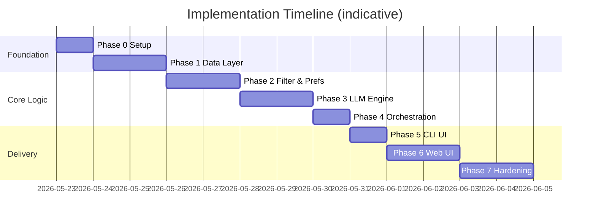
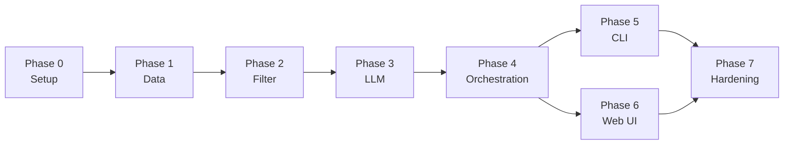

# Phase-Wise Implementation Plan

AI-Powered Restaurant Recommendation System (Zomato Use Case)

This plan breaks delivery into **seven phases**, aligned with [`context.md`](context.md) and [`architecture.md`](architecture.md). Each phase has goals, tasks, deliverables, acceptance criteria, and dependencies.

---

## Plan Overview



| Phase | Name | Primary outcome | Est. effort |
|-------|------|-----------------|-------------|
| **0** | Project setup | Runnable repo, config, dependencies | 0.5–1 day |
| **1** | Data foundation | Dataset loaded, normalized, in-memory store | 1–2 days |
| **2** | Filtering & preferences | Deterministic candidate selection works | 1–2 days |
| **3** | LLM recommendation engine | Rank + explain via structured JSON | 1–2 days |
| **4** | Orchestration pipeline | End-to-end `recommend()` without UI | 0.5–1 day |
| **5** | CLI presentation | User can run recommendations from terminal | 0.5–1 day |
| **6** | Web UI (Streamlit) | Demo-ready interactive app | 1–2 days |
| **7** | Quality & delivery | Tests, docs, error states, README | 1–2 days |

**Total indicative timeline:** ~8–12 working days for a solo developer.

---

## Dependency Graph



Phases 5 and 6 can run **in parallel** after Phase 4. Phase 7 depends on at least one UI path (CLI minimum).

---

## Phase 0: Project Setup & Foundation

### Goal

Establish repository structure, dependencies, configuration, and development conventions so later phases plug in cleanly.

### Tasks

| # | Task | Module / artifact |
|---|------|-------------------|
| 0.1 | Initialize Python project (`src/`, `tests/`, `requirements.txt`) | Repo root |
| 0.2 | Add dependencies: `datasets`, `pandas`, `pydantic`, `python-dotenv`, `groq`, `pytest` | `requirements.txt` |
| 0.3 | Create `src/config.py` with env-based settings (`HF_DATASET_ID`, `TOP_N`, `TOP_K`, budget thresholds) | `config.py` |
| 0.4 | Add `.env.example` and document required keys | `.env.example` |
| 0.5 | Scaffold package layout per architecture doc | `src/models/`, `src/data/`, etc. |
| 0.6 | Add `.gitignore` (`.env`, `__pycache__`, `.cache/`, data artifacts) | `.gitignore` |
| 0.7 | Stub empty `README.md` with setup instructions placeholder | `README.md` |

### Deliverables

- [ ] Runnable `python -c "import src"` (or equivalent package import)
- [ ] `requirements.txt` installable without errors
- [ ] Config loads from environment with sensible defaults
- [ ] Folder structure matches architecture § Recommended Project Structure

### Acceptance criteria

- `pip install -r requirements.txt` succeeds
- `config` exposes `HF_DATASET_ID`, `TOP_N_CANDIDATES`, `TOP_K_RECOMMENDATIONS`, budget thresholds
- No secrets committed; `.env.example` documents all variables

### Maps to context / architecture

- Architecture: [Technology Stack](#), [Environment Variables](#), [Recommended Project Structure](#)
- Context: Technical components (scaffold only)

---

## Phase 1: Data Foundation

### Goal

Load the Hugging Face Zomato dataset, normalize it into canonical `Restaurant` entities, and serve them from an in-memory store.

### Tasks

| # | Task | Module / artifact |
|---|------|-------------------|
| 1.1 | Implement `Restaurant` Pydantic/dataclass model | `src/models/restaurant.py` |
| 1.2 | Implement dataset loader (`load_dataset` from Hugging Face) | `src/data/loader.py` |
| 1.3 | Inspect raw schema; map columns → canonical fields | Notes in code / README |
| 1.4 | Implement preprocessor: location normalize, cuisine parse, rating coerce | `src/data/preprocessor.py` |
| 1.5 | Implement budget band mapping from `cost_for_two` | `config.py` + preprocessor |
| 1.6 | Drop invalid rows; dedupe by name + city | preprocessor |
| 1.7 | Implement `RestaurantStore` (load all, `get_all()`, optional pickle cache) | `src/data/store.py` |
| 1.8 | Startup script or function: `initialize_store()` | `store.py` or `__main__` |
| 1.9 | Unit tests: budget mapping, rating bounds, location alias | `tests/test_preprocessor.py` |

### Deliverables

- [ ] `Restaurant` model with `id`, `name`, `city`, `cuisine`, `rating`, `cost_for_two`, `budget_band`, `raw`
- [ ] Store populated with full dataset (log row count at load)
- [ ] Local HF cache avoids re-download on restart

### Acceptance criteria

- Loader fetches `ManikaSaini/zomato-restaurant-recommendation` successfully
- ≥ 90% of rows produce valid `Restaurant` records (document dropped count)
- Sample query: list restaurants in one known city returns non-empty results
- Preprocessor tests pass in CI / local `pytest`

### Maps to context / architecture

- Context: **Data Ingestion**, Data Source table
- Architecture: Components 1–3 (Loader, Preprocessor, Store), [Data Architecture](#canonical-entity-restaurant), ADR-2, ADR-5

### Risks & mitigations

| Risk | Mitigation |
|------|------------|
| Dataset column names differ from docs | Inspect first batch in Phase 1.3; adjust mapping |
| Large download on slow network | Enable HF local cache; document one-time download |

---

## Phase 2: Filtering & User Preferences

### Goal

Capture and validate user preferences; filter the restaurant store deterministically—no LLM yet.

### Tasks

| # | Task | Module / artifact |
|---|------|-------------------|
| 2.1 | Implement `UserPreferences` model with validation | `src/models/preferences.py` |
| 2.2 | Implement `Budget` enum (`low`, `medium`, `high`) | `preferences.py` |
| 2.3 | Build location alias map in config (e.g. New Delhi → Delhi) | `config.py` |
| 2.4 | Implement `filter_restaurants(prefs, top_n)` | `src/filtering/candidate_filter.py` |
| 2.5 | Filter order: location → cuisine → min_rating → budget → top_n by rating | `candidate_filter.py` |
| 2.6 | Return structured empty result (not exception) when no matches | filter module |
| 2.7 | Unit tests: each filter dimension, empty case, top_n cap | `tests/test_filter.py` |
| 2.8 | Manual smoke: print candidate count for Bangalore + Italian + medium | script / REPL |

### Deliverables

- [ ] `UserPreferences` validates all required fields
- [ ] `filter_restaurants()` returns ≤ `TOP_N` candidates
- [ ] Filter tests with fixture subset of restaurants

### Acceptance criteria

- Given prefs matching known data, filter returns 1–30 candidates
- Given impossible prefs (e.g. rating 5.0 + rare combo), returns empty list with clear metadata
- Filter completes in < 50 ms on full in-memory store (architecture latency target)
- **No LLM calls** in this phase

### Maps to context / architecture

- Context: **User Input**, Integration Layer (filter portion)
- Architecture: Component 4–5 (Preference Collector, Candidate Filter), ADR-1

### Phase 2 exit demo

```bash
# Conceptual — after wiring a tiny debug entrypoint
python -c "
from src.data.store import get_store
from src.filtering.candidate_filter import filter_restaurants
from src.models.preferences import UserPreferences
store = get_store()
prefs = UserPreferences(location='Bangalore', budget='medium', cuisine='Italian', min_rating=4.0)
print(len(filter_restaurants(store.get_all(), prefs)))
"
```

---

## Phase 3: LLM Recommendation Engine

### Goal

Build prompt assembly, LLM client, and response parsing so the system ranks candidates and returns explanations in a structured `RecommendationResponse`.

### Tasks

| # | Task | Module / artifact |
|---|------|-------------------|
| 3.1 | Implement `Recommendation` and `RecommendationResponse` models | `src/models/recommendation.py` |
| 3.2 | Implement `build_recommendation_prompt(prefs, candidates, top_k)` | `src/llm/prompt_builder.py` |
| 3.3 | Encode system prompt: JSON-only, candidate IDs only, ranking criteria | prompt_builder |
| 3.4 | Implement `LLMClient` interface + Groq implementation | `src/llm/client.py` |
| 3.5 | Implement `FakeLLMClient` for tests (fixed JSON response) | `client.py` |
| 3.6 | Configure temperature (0.2–0.5), timeout, retry once on failure | `config.py` + client |
| 3.7 | Implement `parse_llm_response(raw, candidates)` with ID merge | `src/llm/response_parser.py` |
| 3.8 | Strip hallucinated IDs; re-sort by rank; never trust LLM for rating/cost | parser |
| 3.9 | Unit tests: valid JSON, malformed JSON, bad ID, rank reorder | `tests/test_parser.py` |
| 3.10 | Snapshot or contract test for prompt shape | `tests/test_prompt_builder.py` |

### Deliverables

- [ ] Prompt builder produces stable, bounded prompts (≤ TOP_N candidates)
- [ ] Parser returns `RecommendationResponse` with enriched `Restaurant` objects
- [ ] `FakeLLMClient` enables tests without API key

### Acceptance criteria

- Live LLM call (manual) returns top K recommendations with non-empty explanations
- Parser merges IDs correctly; invalid IDs dropped with warning logged
- Retry once on invalid JSON; second failure surfaces clear error type
- Unit tests pass without network (using `FakeLLMClient`)

### Maps to context / architecture

- Context: **Recommendation Engine**, Integration Layer (prompt portion)
- Architecture: Components 6–8, [Recommendation Engine](#), ADR-3, ADR-4

### Risks & mitigations

| Risk | Mitigation |
|------|------------|
| LLM returns markdown-wrapped JSON | Strip fences in parser; reinforce prompt |
| Token overflow | Cap candidates at TOP_N; send minimal fields |
| API cost | Use Groq Llama models; FakeLLM in CI |

---

## Phase 4: Orchestration Pipeline

### Goal

Wire filter → prompt → LLM → parse into a single `RecommenderService.recommend()` entry point.

### Tasks

| # | Task | Module / artifact |
|---|------|-------------------|
| 4.1 | Implement `RecommenderService` | `src/orchestration/recommender.py` |
| 4.2 | Inject store, filter, prompt builder, LLM client, parser (constructor DI) | recommender |
| 4.3 | Handle empty candidates → return response with message, no LLM call | recommender |
| 4.4 | Populate `metadata` (candidates_considered, filters_applied) | `RecommendationResponse` |
| 4.5 | Add logging: filter count, LLM latency, parse warnings | orchestration |
| 4.6 | Integration test: full pipeline with `FakeLLMClient` | `tests/test_recommender.py` |
| 4.7 | Preload store at service init (singleton or app startup) | store + recommender |

### Deliverables

- [ ] `RecommenderService.recommend(prefs) -> RecommendationResponse`
- [ ] Integration test covering happy path and empty filter path

### Acceptance criteria

- One function call runs full pipeline per architecture sequence diagram
- Empty filter skips LLM (saves cost, faster response)
- Integration test asserts rank order, explanation presence, correct restaurant names from dataset
- End-to-end flow matches context success criteria: **ingest → filter → LLM → structured output**

### Maps to context / architecture

- Context: **System Workflow** (full chain)
- Architecture: [Request Lifecycle](#), [Orchestrator](#), ADR-1–5

### Phase 4 milestone (internal demo)

Programmatic call returns 5 ranked restaurants with explanations—no UI required.

---

## Phase 5: CLI Presentation Layer

### Goal

Expose the pipeline via a command-line interface so users can submit preferences and see results immediately.

### Tasks

| # | Task | Module / artifact |
|---|------|-------------------|
| 5.1 | Implement CLI with `argparse` (location, budget, cuisine, min-rating, additional) | `src/ui/cli.py` |
| 5.2 | Validate inputs before calling `RecommenderService` | cli |
| 5.3 | Format output: summary + ranked cards (name, cuisine, rating, cost, explanation) | cli |
| 5.4 | Empty and error states with user-friendly messages | cli |
| 5.5 | Loading indicator or message during LLM wait | cli |
| 5.6 | Document CLI usage in README | `README.md` |

### Deliverables

- [ ] Runnable: `python -m src.ui.cli --location Bangalore --budget medium --cuisine Italian --min-rating 4.0`

### Acceptance criteria

- CLI matches architecture CLI contract
- Output includes all fields from context **Output Display**
- Invalid args show help text, not stack trace
- Manual E2E: known prefs produce ≥ 1 recommendation

### Maps to context / architecture

- Context: **Output Display**, objective #4 (display results)
- Architecture: [Presentation Layer](#) — CLI mode

---

## Phase 6: Web UI (Streamlit)

### Goal

Deliver a demo-ready web interface with preference form, loading state, and recommendation cards.

### Tasks

| # | Task | Module / artifact |
|---|------|-------------------|
| 6.1 | Add `streamlit` to requirements | `requirements.txt` |
| 6.2 | Implement Streamlit app: preference form | `src/ui/app.py` |
| 6.3 | Wire form submit → `RecommenderService.recommend()` | app |
| 6.4 | Show spinner during LLM inference | app |
| 6.5 | Render result cards per architecture layout | app |
| 6.6 | Display optional summary block above results | app |
| 6.7 | Empty state: "No restaurants found…" | app |
| 6.8 | Error state: LLM failure message | app |
| 6.9 | Cache/store initialization with `@st.cache_resource` | app |
| 6.10 | Document: `streamlit run src/ui/app.py` | `README.md` |

### Deliverables

- [ ] Streamlit app runnable on `localhost:8501`
- [ ] Screenshots or GIF optional for README

### Acceptance criteria

- User can submit all preference fields from context table
- Results show name, cuisine, rating, estimated cost, AI explanation
- App survives refresh (store cached)
- UX flow: Form → Loading → Results (architecture screen flow)

### Maps to context / architecture

- Context: User Input + Output Display
- Architecture: [Presentation Layer](#) — Web mode, empty/error states

### Optional (defer if time-constrained)

- Gradio alternative
- "Refine search" pre-filled form from last query

---

## Phase 7: Quality, Hardening & Delivery

### Goal

Make the project reliable, documented, and submission-ready: tests, logging, security basics, README.

### Tasks

| # | Task | Module / artifact |
|---|------|-------------------|
| 7.1 | Complete unit test suite (preprocessor, filter, parser, prompt) | `tests/` |
| 7.2 | Add orchestration integration test with mocks | `tests/test_recommender.py` |
| 7.3 | Sanitize `additional_preferences` length; prompt injection guard in system prompt | prompt_builder |
| 7.4 | Centralize logging (INFO load, DEBUG filter, WARN parse) | cross-cutting |
| 7.5 | Finalize `README.md`: overview, setup, env vars, CLI, Streamlit, architecture link | `README.md` |
| 7.6 | Verify `.env.example` complete | `.env.example` |
| 7.7 | Manual test matrix (see below) | QA notes |
| 7.8 | Optional: Dockerfile or run script for demo | `Dockerfile` or `scripts/run.sh` |
| 7.9 | Optional: basic GitHub Actions `pytest` workflow | `.github/workflows/ci.yml` |

### Manual test matrix

| # | Scenario | Expected |
|---|----------|----------|
| T1 | Valid prefs with many matches | 5 ranked results + explanations |
| T2 | Very high `min_rating` | Empty state, no LLM call |
| T3 | Unknown city | Empty or fuzzy-match message |
| T4 | `additional_preferences`: "family-friendly" | Explanations reference preference |
| T5 | Invalid API key | Clear error, no crash |
| T6 | Repeat same query | Consistent results (low temperature) |

### Deliverables

- [ ] `pytest` passes locally
- [ ] README enables new developer to run in < 15 minutes
- [ ] All context **Success Criteria** verified

### Acceptance criteria (project complete)

| Criterion (from context) | Verification |
|------------------------|--------------|
| Recommendations reflect location, budget, cuisine, rating | T1, T4 |
| Output readable: name, cuisine, rating, cost, explanation | CLI + Streamlit |
| LLM adds value beyond filter | Compare filter-only order vs LLM rank in T1 |
| Full pipeline ingest → input → filter → LLM → display | Phases 1–6 integrated |

### Maps to context / architecture

- Context: **Success Criteria**, **Constraints & Assumptions**
- Architecture: [Testing Strategy](#), [Cross-Cutting Concerns](#), [Deployment Architecture](#) MVP

---

## Per-Phase Checklist Summary

Use this as a sprint board:

```
Phase 0  [ ] Repo  [ ] deps  [ ] config  [ ] structure
Phase 1  [ ] loader  [ ] preprocessor  [ ] store  [ ] tests
Phase 2  [ ] UserPreferences  [ ] filter  [ ] tests
Phase 3  [x] prompt  [x] client  [x] parser  [x] FakeLLM  [x] tests
Phase 4  [ ] RecommenderService  [ ] integration test
Phase 5  [ ] CLI  [ ] README CLI section
Phase 6  [ ] Streamlit  [ ] empty/error UI
Phase 7  [ ] full pytest  [ ] README  [ ] manual matrix  [ ] success criteria
```

---

## File Creation Order (recommended)

Build files in this order to minimize rework:

```
1.  requirements.txt, .env.example, .gitignore
2.  src/config.py
3.  src/models/restaurant.py
4.  src/models/preferences.py
5.  src/models/recommendation.py
6.  src/data/loader.py
7.  src/data/preprocessor.py
8.  src/data/store.py
9.  src/filtering/candidate_filter.py
10. src/llm/prompt_builder.py
11. src/llm/client.py
12. src/llm/response_parser.py
13. src/orchestration/recommender.py
14. src/ui/cli.py
15. src/ui/app.py
16. tests/*
17. README.md
```

---

## Definition of Done (project level)

The milestone is **complete** when:

1. **Data:** Zomato dataset loads from Hugging Face and is queryable via in-memory store.
2. **Filter:** User preferences reduce candidates deterministically with empty-state handling.
3. **LLM:** Top-K recommendations include AI explanations and optional summary; numeric fields from dataset only.
4. **UI:** At least CLI **and** Streamlit work end-to-end.
5. **Quality:** Core unit + integration tests pass; README documents setup and usage.
6. **Docs:** `context.md`, `architecture.md`, and this plan remain accurate or updated if scope changes.

---

## Post-Milestone Backlog (optional phases)

Not required for initial delivery; listed for future sprints:

| Phase | Enhancement |
|-------|-------------|
| **8** | FastAPI REST layer (`POST /api/recommendations`) |
| **9** | SQLite store + indexed filters |
| **10** | LLM response caching (Redis or file cache) |
| **11** | Semantic search with embeddings |
| **12** | Docker + cloud deploy (Railway, Render, etc.) |

See architecture [Future Extensions](#future-extensions) for details.

---

## References

| Document | Purpose |
|----------|---------|
| [`context.md`](context.md) | Product goals, workflow, success criteria |
| [`architecture.md`](architecture.md) | Components, schemas, interfaces, ADRs |
| [`docs/problem_statement.txt`](docs/problem_statement.txt) | Original assignment spec |
